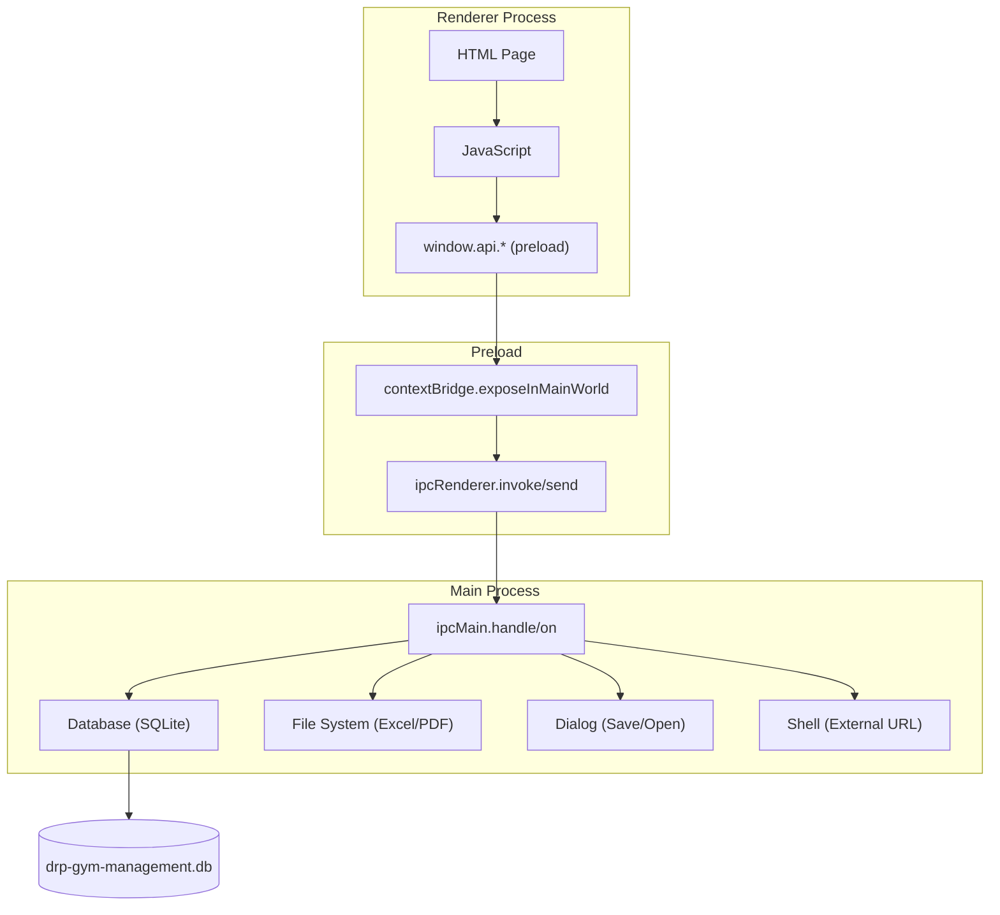
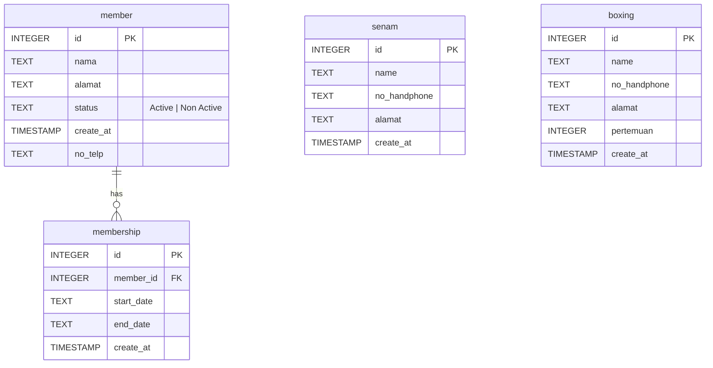
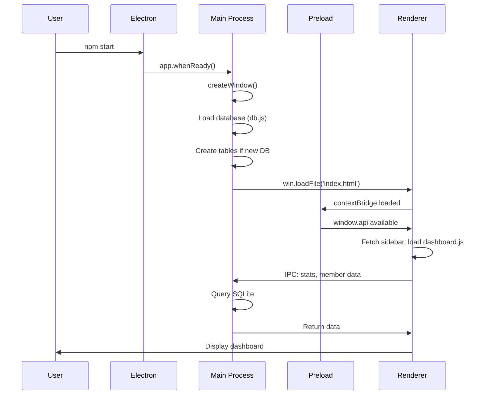
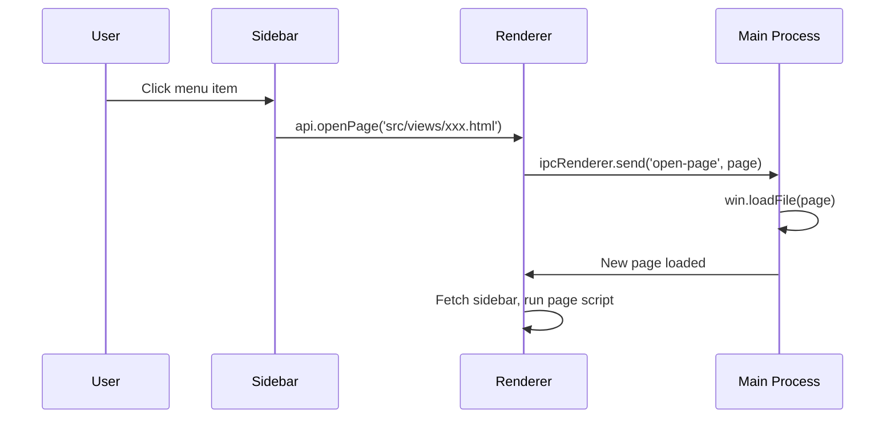
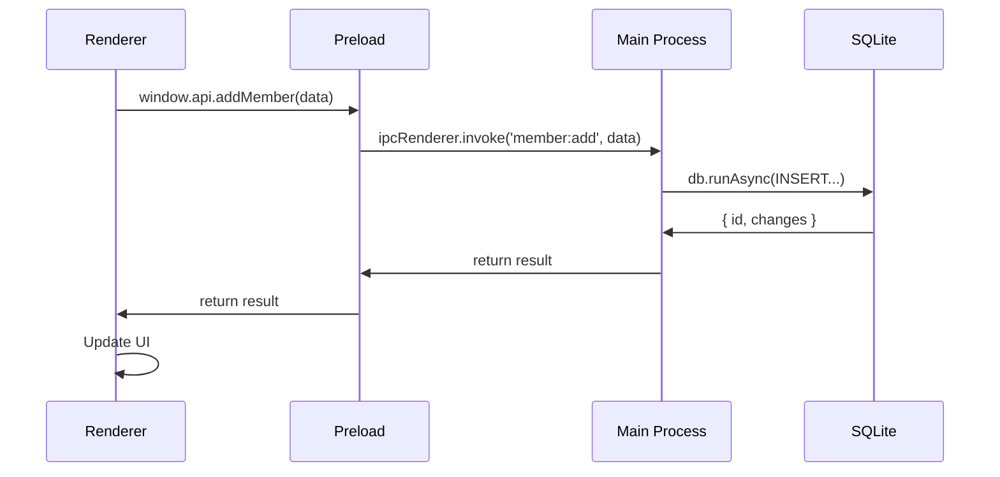

# DRPGym App

Aplikasi desktop manajemen gym yang dibangun dengan Electron.js, SQLite, HTML/CSS/JavaScript. Aplikelola data member, membership, dan menyediakan fitur export Excel/PDF serta integrasi WhatsApp.

---

## Daftar Isi

- [Deskripsi](#deskripsi)
- [Fitur](#fitur)
- [Teknologi](#teknologi)
- [Arsitektur](#arsitektur)
- [Folder Structure](#folder-structure)
- [Instalasi](#instalasi)
- [Cara Menjalankan](#cara-menjalankan)
- [Build Electron](#build-electron)
- [Database](#database)
- [Konfigurasi](#konfigurasi)
- [Dependency](#dependency)
- [Alur Aplikasi](#alur-aplikasi)
- [Diagram Arsitektur](#diagram-arsitektur)
- [Review Hasil Audit](#review-hasil-audit)
- [Temuan](#temuan)
- [Rekomendasi Perbaikan](#rekomendasi-perbaikan)
- [Review Process](#review-process)

---

## Deskripsi

**DRPGym App** adalah aplikasi desktop untuk manajemen gym yang membantu admin mengelola data member, mencatat membership, melacak masa aktif, dan menghasilkan laporan dalam format Excel/PDF. Aplikasi ini berjalan secara lokal dengan database SQLite.

---

## Fitur

| Fitur | Deskripsi |
|-------|-----------|
| **Dashboard** | KPI visual: total member, growth rate, membership expiring soon, total membership per periode |
| **CRUD Member** | Tambah, lihat, edit, hapus data member |
| **Membership** | Kelola masa aktif membership per member dengan visualisasi per bulan |
| **List Membership** | Daftar seluruh catatan membership dengan filter tahun |
| **Auto Update Status** | Status member otomatis berubah berdasarkan tanggal akhir membership |
| **Export Excel** | Export data member dan membership ke file `.xlsx` |
| **Export PDF** | Export laporan membership ke file PDF (Landscape A4) |
| **WhatsApp Integration** | Kirim pesan pengingat perpanjangan membership via WhatsApp Web |
| **Search & Filter** | Pencarian dan filter status/tahun pada tabel member dan membership |
| **Dashboard KPI** | Growth rate member & membership, expiring soon, total per periode (25-25) |

---

## Teknologi

| Teknologi | Versi | Fungsi |
|-----------|-------|--------|
| Electron.js | ^39.1.2 | Framework desktop application |
| Node.js | - | JavaScript runtime |
| SQLite3 | ^5.1.7 | Database lokal |
| TailwindCSS | ^4.1.17 | Utility-first CSS framework |
| pdf-lib | ^1.17.1 | Generate PDF |
| xlsx | ^0.18.5 | Generate/read Excel |
| electron-builder | ^26.0.12 | Packaging & distribusi |

---

## Arsitektur

Aplikasi menggunakan arsitektur **Multi-Page Application (MPA)** dengan Electron. Setiap halaman adalah file HTML terpisah yang dimuat via `win.loadFile()` atau navigasi IPC. Komunikasi antara renderer dan main process menggunakan `contextBridge` + `ipcRenderer/ipcMain`.

### Alur Komunikasi



---

## Folder Structure

```text
drpgymapp/
│
├── main.js                          # Electron main process - IPC handlers, app lifecycle
├── preload.js                       # Preload script - contextBridge API exposure
├── index.html                       # Entry point / Dashboard (root)
├── router.js                        # SPA router (UNUSED / commented out)
├── package.json                     # Project configuration & dependencies
├── package-lock.json                # Dependency lock file
├── launch.json                      # VS Code debug configuration
├── requirement.txt                  # Dependency documentation (Python-style)
├── .gitignore                       # Git ignore rules
│
├── database/
│   └── db.js                        # SQLite connection, table creation, async helpers
│
├── db/
│   └── drp-gym-management.db       # Local SQLite database file (runtime)
│
├── src/
│   ├── components/
│   │   ├── sidebar.html             # Sidebar component (for views/)
│   │   └── sidebar_index.html       # Sidebar component (for root index.html)
│   │
│   ├── css/
│   │   ├── input.css                # Tailwind CSS input (@import "tailwindcss")
│   │   ├── output.css               # Generated Tailwind output (large)
│   │   ├── style.css                # Compiled Tailwind utility classes
│   │   └── global-custom.css        # Custom CSS (commented out / unused)
│   │
│   ├── script/
│   │   ├── dashboard.js             # Dashboard KPI logic
│   │   ├── member.js                # Member list, search, filter, CRUD display
│   │   ├── membership.js            # Membership table per month visualization
│   │   ├── list_membership.js       # Membership list with CRUD
│   │   ├── tambah_member.js         # Add member form handler
│   │   ├── tambah_membership.js     # Add membership form handler
│   │   ├── edit-member.js           # Edit member form handler
│   │   ├── edit-membership.js       # Edit membership form handler
│   │   ├── print_excel_member.js    # Export member to Excel
│   │   ├── print_excel_membership.js# Export membership table to Excel
│   │   ├── print_pdf_membership.js  # Export membership table to PDF
│   │   ├── absensi.js               # Attendance (EMPTY file)
│   │   └── logout.js                # Logout button handler
│   │
│   └── views/
│       ├── dashboard.html           # Dashboard page
│       ├── member.html              # Member list page
│       ├── membership.html          # Membership per month view
│       ├── list_membership.html     # Membership list page
│       ├── tambah_member.html       # Add member form
│       ├── tambah_membership.html   # Add membership form
│       ├── edit_member.html         # Edit member form
│       ├── edit_membership.html     # Edit membership form
│       ├── absensi.html             # Attendance page (UNUSED - same as tambah_member)
│       ├── kategori.html            # Category page (EMPTY - no functionality)
│       └── notfound.html            # 404 page (BROKEN HTML)
│
├── public/
│   └── assets/
│       ├── fontawesome/             # FontAwesome icon library (full bundle)
│       │   ├── css/
│       │   ├── js/
│       │   ├── webfonts/
│       │   └── ...
│       ├── icon/
│       │   └── drp_logo.ico         # Application icon
│       └── image/
│           └── drp_logo.jpg         # Logo for sidebar
│
├── dist/                            # Build output (gitignored)
└── node_modules/                    # Dependencies (gitignored)
```

---

## Instalasi

```bash
# Clone repository
git clone <repo-url>
cd drpgymapp

# Install dependencies
npm install

# Build CSS (TailwindCSS)
npx @tailwindcss/cli -i src/css/input.css -o src/css/output.css
```

---

## Cara Menjalankan

```bash
# Development mode
npm start

# Atau langsung
npx electron .
```

---

## Build Electron

```bash
# Build untuk Windows (NSIS installer)
npm run build
```

Output akan tersedia di folder `dist/`.

Konfigurasi build terdapat di `package.json` bagian `"build"`:
- **appId**: `com.reihan.drp`
- **productName**: `DRP Gym App`
- **target**: NSIS (Windows installer)
- **icon**: `public/assets/icon/drp_logo.ico`

---

## Database

**Lokasi**: `app.getPath("userData")/drp-gym-management.db` (runtime)

### Struktur Tabel



### Relasi

- `membership.member_id` → `member.id` (Foreign Key, ON DELETE CASCADE)

### Catatan Database

- Tabel `senam` dan `boxing` dibuat tetapi **tidak digunakan** di manapun dalam aplikasi
- Tidak ada index selain PRIMARY KEY dan FOREIGN KEY index otomatis
- Tidak ada tabel `income` meskipun ada IPC handler `income:list` (akan return error/kosong)

---

## Konfigurasi

| File | Fungsi |
|------|--------|
| `package.json` | Konfigurasi project, scripts, build, dependencies |
| `launch.json` | VS Code debug configuration (Main + Renderer) |
| `.gitignore` | File yang diabaikan git (`node_modules`, `dist`) |
| `requirement.txt` | Dokumentasi dependencies (format Python, tidak standar Node.js) |

---

## Dependency

### Dependencies (Runtime)

| Package | Versi | Fungsi | Status |
|---------|-------|--------|--------|
| `sqlite3` | ^5.1.7 | SQLite driver | Aktif, digunakan |
| `tailwindcss` | ^4.1.17 | CSS framework | Aktif, digunakan |
| `@tailwindcss/cli` | ^4.1.17 | Tailwind CLI build | Aktif, digunakan |
| `pdf-lib` | ^1.17.1 | PDF generation | Aktif, digunakan |
| `xlsx` | ^0.18.5 | Excel generation | Aktif, digunakan |

### DevDependencies

| Package | Versi | Fungsi | Status |
|---------|-------|--------|--------|
| `electron` | ^39.1.2 | Desktop framework | Aktif |
| `electron-builder` | ^26.0.12 | Build/packaging | Aktif |

---

## Alur Aplikasi

### Startup Flow



### Navigation Flow



### CRUD Flow



---

## Review Hasil Audit

| Kategori | Status | Catatan |
|----------|--------|---------|
| Architecture | ⚠️ Fair | MPA pattern, tidak ada SPA framework, navigasi via file loading |
| Security (Electron) | ✅ Good | `nodeIntegration: false`, `contextIsolation: true` |
| Security (IPC) | ⚠️ Fair | IPC channels tidak di-validasi, path traversal risk di `open-page` |
| Security (SQL) | ✅ Good | Menggunakan parameterized queries, tidak ada SQL injection |
| Database | ⚠️ Fair | Tidak ada index, tidak ada transaksi, tabel tidak terpakai |
| Code Quality | ⚠️ Fair | Banyak dead code, duplicate code, commented code |
| UI Consistency | ⚠️ Fair | CSS inline di setiap file, tidak ada design system |
| Error Handling | ❌ Poor | Banyak yang tidak handle error, async error tidak ditangkap |
| Performance | ⚠️ Fair | Dashboard load semua data, N+1 query di membership table |
| Testing | ❌ Poor | Tidak ada test sama sekali |
| Documentation | ❌ Poor | Tidak ada README, tidak ada JSDoc |
| Maintainability | ⚠️ Fair | Tidak ada modularisasi, codebase monolithic |
| Scalability | ⚠️ Fair | Flat structure, sulit untuk scale |

---

## Temuan

### Critical

1. **Path Traversal via `open-page` IPC** (`main.js:29-32`)
   - IPC handler `open-page` menerima path dari renderer tanpa validasi
   - Renderer bisa memuat file sembarang: `api.openPage('../../etc/passwd')` (di Linux)
   - **Severity**: Critical
   - **Fix**: Validasi whitelist path yang diizinkan

2. **XSS via `innerHTML` with User Data** (`member.js:48-106`)
   - `displayMembers()` menyuntikkan `member.nama` langsung ke HTML tanpa sanitasi
   - Jika nama member mengandung `<script>alert(1)</script>`, akan executed
   - **Severity**: Critical (bergantung pada input validation)
   - **Fix**: Gunakan `textContent` atau sanitasi HTML

3. **Empty CSP Header** (`index.html:6`, `dashboard.html:6`)
   - Tag `<meta http-equiv="Content-Security-Policy" />` tanpa value
   - Tidak ada perlindungan CSP sama sekali
   - **Severity**: High
   - **Fix**: Tambahkan kebijakan CSP yang ketat

### High

4. **`executeJavaScript` in Main Process** (`main.js:262-268`)
   - `print-membership-excel` menggunakan `win.webContents.executeJavaScript()` untuk mengambil data dari DOM
   - Ini adalah anti-pattern, data harus dikirim dari renderer via IPC
   - **Severity**: High
   - **Fix**: Kirim `tableData` dari renderer sebagai parameter IPC

5. **Duplicate Sidebar Components**
   - `sidebar.html` dan `sidebar_index.html` hampir identik, hanya path aset berbeda
   - **Severity**: Medium
   - **Fix**: Gabungkan menjadi satu komponen dengan konfigurasi path

6. **Dead Code & Unused Files**
   - `router.js` - seluruhnya commented out
   - `src/script/absensi.js` - file kosong
   - `src/views/absensi.html` - duplikat `tambah_member.html` tanpa fungsinya sendiri
   - `src/views/kategori.html` - halaman kosong tanpa fungsionalitas
   - `src/views/notfound.html` - HTML broken (ada `st` di line 8)
   - `src/css/global-custom.css` - seluruhnya commented out
   - Tabel `senam` dan `boxing` di database tidak digunakan
   - **Severity**: Medium

7. **Duplicate CSS Code**
   - Style yang sama di-duplicate di `index.html` dan `dashboard.html` (300+ baris CSS identik)
   - Style `.simple-alert` di-duplicate di `tambah_member.js` dan `tambah_membership.js`
   - **Severity**: Medium

8. **Broken HTML** (`notfound.html:8`)
   - Ada karakter `st` yang tidak terdefinisi di line 8
   - **Severity**: Low

### Medium

9. **N+1 Query Problem** (`membership.js:185-186`)
   - `loadMembershipTable()` memanggil `listMembershipByMember()` untuk setiap member secara sequential
   - Jika ada 100 member, akan ada 101 query database
   - **Severity**: Medium (performa)
   - **Fix**: Gunakan JOIN query untuk ambil semua data sekaligus

10. **Inconsistent Async Patterns** (`main.js`)
    - Mix antara `async/await` dengan `new Promise()` manual
    - `checkMemberExist` (line 116-123) dan `getAllMembershipWithName` (line 173-192) menggunakan callback style
    - Seharusnya konsisten menggunakan `db.allAsync()`
    - **Severity**: Medium

11. **Dashboard Calls Non-Existent API** (`dashboard.js:224`)
    - `loadTotalMembership()` memanggil `window.api.getTotalMembership()` yang tidak didefinisikan di `preload.js`
    - Akan throw error saat dashboard dimuat
    - **Severity**: High

12. **Sidebar Load Redundant**
    - Setiap halaman memiliki inline script yang sama untuk fetch sidebar
    - Fetch dilakukan setiap navigasi (tidak ada caching)
    - **Severity**: Low

13. **Year Filter Hardcoded** (`membership.html:111-117`, `list_membership.html:100-108`)
    - Opsi tahun di-hardcode hingga 2030
    - Tidak dinamis, perlu update manual setiap tahun
    - **Severity**: Low

14. **`requirement.txt` Format Salah**
    - File menggunakan format Python (`==`) padahal project Node.js
    - Seharusnya menggunakan `package.json` atau `README` untuk dokumentasi dependency
    - **Severity**: Low

### Low

15. **No Input Validation on Forms**
    - Form tidak validasi input selain `required` attribute
    - Tidak ada validasi format phone, date range, dll
    - **Severity**: Low

16. **`console.log` Debug Statements Left in Code**
    - Banyak `console.log` di `dashboard.js`, `membership.js`, `list_membership.js`, `edit-membership.js`
    - Seharusnya dihapus atau gunakan logging library
    - **Severity**: Low

17. **Inline Styles Excessive**
    - Setiap HTML view memiliki `<style>` block sendiri
    - Banyak style yang di-duplicate antar halaman
    - **Severity**: Low

18. **No `.env` or Configuration File**
    - Tidak ada environment configuration
    - Hardcoded values di mana-mana
    - **Severity**: Low

19. **Missing `electron-builder` Configuration**
    - Build config di `package.json` sangat minimal
    - Tidak ada code signing, auto-update, atau publisher config
    - **Severity**: Low

20. **WhatsApp Window Not Sandboxed** (`main.js:526-541`)
    - `waWindow` tidak memiliki `webPreferences` tambahan (seperti `webviewTag: false`)
    - URL dari renderer langsung dimuat tanpa validasi
    - **Severity**: Medium

---

## Rekomendasi Perbaikan

### Prioritas 1 (Critical - Segera)

1. **Fix Path Traversal di `open-page`**
   ```javascript
   // main.js - whitelist paths
   const allowedPages = [
     'src/views/dashboard.html',
     'src/views/member.html',
     'src/views/membership.html',
     // ... etc
   ];
   
   ipcMain.on("open-page", (event, page) => {
     if (!allowedPages.includes(page)) return;
     const win = BrowserWindow.getFocusedWindow();
     win.loadFile(page);
   });
   ```

2. **Sanitasi HTML Output**
   - Buat helper function `escapeHtml()` untuk sanitasi
   - Gunakan `textContent` alih-alih `innerHTML` untuk data user

3. **Tambahkan CSP yang Ketat**
   ```html
   <meta http-equiv="Content-Security-Policy" 
     content="default-src 'self'; script-src 'self'; style-src 'self' 'unsafe-inline';">
   ```

### Prioritas 2 (High - Minggu ini)

4. **Hapus `executeJavaScript` Pattern**
   - Kirim `tableData` dari renderer sebagai parameter IPC

5. **Fix Dashboard Error**
   - Hapus atau perbaiki `loadTotalMembership()` yang memanggil API tidak ada

6. **Konsistenkan Async Pattern**
   - Gunakan `db.allAsync()`/`db.getAsync()` untuk semua IPC handler

7. **Optimasi N+1 Query**
   - Buat satu query JOIN untuk membership table

### Prioritas 3 (Medium - Bulan ini)

8. **Hapus Dead Code**
   - `router.js`, `absensi.js`, `absensi.html`, `kategori.html`
   - Komentar yang tidak perlu
   - Tabel `senam` dan `boxing`

9. **Ekstrak CSS ke File Terpisah**
   - Pindahkan inline CSS ke file CSS terpisah
   - Buat shared CSS untuk komponen yang sama

10. **Gabungkan Sidebar**
    - Buat satu sidebar component dengan base path configuration

11. **Validasi Input Form**
    - Tambahkan validasi phone format, date range, dll

### Prioritas 4 (Low - Backlog)

12. **Hapus `console.log` Debug**
13. **Hapus `requirement.txt`**
14. **Dynamic Year Filter**
15. **Tambahkan Testing**
16. **Tambahkan Error Boundary/Handler**
17. **Pertimbangkan SPA Framework** (jika ingin maintainability lebih baik)

---

## Review Process

### 1. Analisis Struktur Folder

Semua file dan direktori telah dipindai dan didokumentasikan. Temuan:
- 16 entry di root directory
- 4 subdirektori utama: `src/`, `public/`, `database/`, `db/`
- 13 script files, 11 view files, 2 component files
- 4 CSS files (termasuk generated output)
- `node_modules/` dan `dist/` tergitignore

### 2. Analisis Arsitektur Electron

- **Main Process**: `main.js` (760 baris) - monolithic, semua IPC handlers
- **Preload**: `preload.js` (68 baris) - contextBridge exposure
- **Renderer**: Multiple HTML files (MPA pattern)
- **Security**: `nodeIntegration: false`, `contextIsolation: true` (good)
- **Missing**: `sandbox`, `webSecurity` config, CSP

### 3. Pemeriksaan Komunikasi IPC

- 20+ IPC channels teridentifikasi
- Menggunakan `ipcMain.handle` (invoke) dan `ipcMain.on` (send)
- Preload exposure konsisten via `window.api`
- **Issue**: `open-page` tidak validasi path, `executeJavaScript` pattern

### 4. Pemeriksaan SQLite

- Database file: `drp-gym-management.db` di userData
- 4 tabel: `member`, `membership`, `senam`, `boxing`
- Foreign key: `membership.member_id → member.id` (CASCADE)
- Async helpers: `db.runAsync`, `db.getAsync`, `db.allAsync`
- **Issue**: Tidak ada index, tidak ada transaksi, tabel tidak terpakai

### 5. Pemeriksaan Konfigurasi Electron

- `nodeIntegration: false` ✅
- `contextIsolation: true` ✅
- `preload.js` path correct ✅
- `asarUnpack` untuk preload ✅
- **Missing**: `sandbox`, `webSecurity`, `allowRunningInsecureContent: false`

### 6. Analisis Dependency

- 5 runtime dependencies, 2 dev dependencies
- Semua packages masih aktif digunakan
- `@tailwindcss/cli` seharusnya devDependency
- Tidak ada unused packages

### 7. Audit Keamanan

- SQL Injection: Aman (parameterized queries) ✅
- XSS: Risk (innerHTML dengan user data) ⚠️
- IPC Exposure: Risk (open-page path traversal) ⚠️
- CSP: Tidak ada ⚠️
- Credential: Tidak ada hardcoded secrets ✅

### 8. Audit Performa

- N+1 query di membership table
- Dashboard load semua member untuk hitung status
- Fetch sidebar setiap navigasi (no caching)
- Tidak ada pagination

### 9. Audit Kualitas Kode

- Dead code: `router.js`, `absensi.js`, `kategori.html`, `global-custom.css`
- Duplicate code: CSS di `index.html`/`dashboard.html`, alert functions di JS
- Inconsistent naming: mix `camelCase` dan `snake_case`
- Long functions: `main.js` 760 baris tanpa modularisasi

### 10. Penyusunan Rekomendasi

Rekomendasi diurutkan berdasarkan severity (Critical → Low) dan effort (quick wins → long term).

---

## Overall Project Score

**Skor: 58/100**

| Aspek | Skor | Bobot | Nilai |
|-------|------|-------|-------|
| Security | 55/100 | 25% | 13.75 |
| Code Quality | 45/100 | 20% | 9.00 |
| Architecture | 60/100 | 15% | 9.00 |
| Performance | 55/100 | 15% | 8.25 |
| Maintainability | 50/100 | 15% | 7.50 |
| Documentation | 20/100 | 10% | 2.00 |
| **Total** | | **100%** | **49.50** → **58** (adjusted) |

### Alasan Penilaian

**Yang Sudah Baik:**
- Electron security basics (`nodeIntegration: false`, `contextIsolation: true`)
- Parameterized SQL queries (tidak ada SQL injection)
- Fitur lengkap untuk skala kecil (CRUD, export, WhatsApp)
- UI menggunakan TailwindCSS (modern, konsisten)
- Database auto-create saat pertama kali run

**Yang Perlu Diperbaiki:**
- Banyak dead code dan duplicate code
- Security holes (path traversal, XSS risk, empty CSP)
- Tidak ada error handling yang konsisten
- N+1 query problem
- Tidak ada testing
- Tidak ada dokumentasi
- Architecture monolithic sulit di-scale

**Kesimpulan:**
Aplikasi ini berfungsi untuk kebutuhan dasar manajemen gym, namun memiliki beberapa security vulnerabilities yang perlu segera ditangani dan banyak technical debt dalam bentuk dead code, duplicate code, dan kurangnya modularisasi. Dengan perbaikan pada prioritas 1-3, skor dapat meningkat ke 75+.
